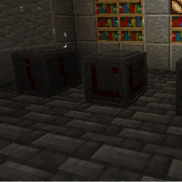

---
navigation:
  title: "Rune Stones"
  icon: "runecraft:rune_stone"
  position: 1
  parent: runecraft:basics.md
item_ids:
  - runecraft:rune_stone
---

# Rune Stones

Rune stones are another important ingredient. they are needed for recipes and combined with *Runes* have strong magical effects. 

They should be used first to craft an *Altar*!

The tricky part of the recipe is the *Spirit Crystal*, it can only be traded from a *Wandering Trader* or get it from an *Evoker* at this point .

<Recipe id="runecraft:rune_stones/blank_rune_stone" />

TODO: Unsupported flag 'border'

## How to use Rune Stones

With a **right click** you can place a *Rune* on a *Rune Stone* and thus activate various effects (like speed, regeneration or damage). 

The effects occur on touch when the block is right-clicked or gets a redstone signal. 

**Shift + Right click** removes the *Rune* again.

