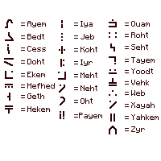
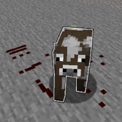

---
navigation:
  title: "Runes"
  icon: "runecraft:rune_q"
  parent: runecraft:basics.md
item_ids:
  - runecraft:rune_dust
  - runecraft:rune_m
---

# Runes

Runes are at the core of everything here, there's one for every letter, plus a few extra ones! 

*Rune Dust* is required to start, this is made from Ash and *Nether Warts* on the one hand. *Ash* can be found as blocks in the nether in basalt deltas or by killing *Blazes*.

All the *Runes* of the alphabet can now be crafted from the dust.

<Recipe id="runecraft:rune_dust" />

<Recipe id="runecraft:runes/rune_m" />

## The Runic Alphabet

You can also place runes on the ground, they have the property of marking all living beings that touch them, even through obstacles!

