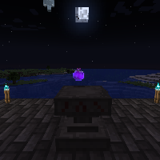

---
navigation:
  title: "Alchemy Ritual"
  icon: "runecraft:alchemy_page"
  position: 3
  parent: runecraft:rituals.md
---

# Alchemy Ritual

## Alchemy Ritual

<ItemImage id="runecraft:alchemy_page" />

**__Requirements:__** 

- Altar 
- XP 
- Nighttime

**__Effect:__** 

Lets you summon a random strong *Potion*.

