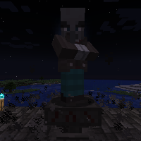

---
navigation:
  title: "Curse Ritual"
  icon: "runecraft:curse_page"
  position: 4
  parent: runecraft:rituals.md
---

# Curse Ritual

## Curse Ritual

<ItemImage id="runecraft:curse_page" />

**__Requirements:__** 

- *Altar 
- XP 
- Nighttime *

**__Effect:__** 

Lets you summon a random evil *Creature*.

TODO: Unsupported flag 'border'

