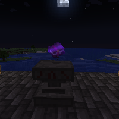

---
navigation:
  title: "Enchanting Ritual"
  icon: "runecraft:enchanting_page"
  position: 6
  parent: runecraft:rituals.md
---

# Enchanting Ritual

## Enchanting Ritual

<ItemImage id="runecraft:enchanting_page" />

**__Requirements:__** 

- *Altar 
- XP 
- Nighttime *

**__Effect:__** 

Lets you summon a rare *Enchanted Book*.

TODO: Unsupported flag 'border'

