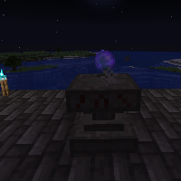

---
navigation:
  title: "Orb Ritual"
  icon: "runecraft:orb_page"
  position: 5
  parent: runecraft:rituals.md
---

# Orb Ritual

## Orb Ritual

<ItemImage id="runecraft:orb_page" />

**__Requirements:__** 

- *Altar 
- XP 
- Nighttime *

**__Effect:__** 

Lets you summon a *Orb*, that can be transformed into many different items.

TODO: Unsupported flag 'border'

