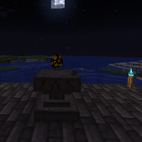

---
navigation:
  title: "Soulbind Ritual"
  icon: "runecraft:soul"
  position: 10
  parent: runecraft:rituals.md
---

# Soulbind Ritual

## Soulbind Ritual

<ItemImage id="runecraft:soul" />

**__Requirements:__** 

- Altar 
- XP 
- Nighttime

**__Effect:__** 

Lets you bind *Souls* in *Spawn Eggs*.

