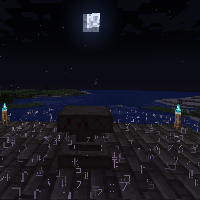

---
navigation:
  title: "Spell Ritual"
  icon: "runecraft:spell_page"
  position: 2
  parent: runecraft:rituals.md
---

# Spell Ritual

## Spell Ritual

<ItemImage id="runecraft:spell_page" />

**__Requirements:__** 

- *Altar 
- XP 
- Nighttime *

**__Effect:__** 

Lets you summon a *Effect Cloud* with random abilities.

TODO: Unsupported flag 'border'

