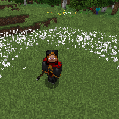

---
navigation:
  title: "Basic Wand"
  icon: "runecraft:basic_wand"
  parent: runecraft:wands.md
---

# Basic Wand

<ItemImage id="runecraft:basic_wand" />

Can be obtained through a *Wand Ritual* at the *Altar.* 

__**Effects**__ 

**Right Click:** 
Releases a spell ring of weakness.

