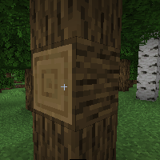

---
navigation:
  title: "Changing Wand"
  icon: "runecraft:changing_wand"
  position: 4
  parent: runecraft:wands.md
item_ids:
  - runecraft:changing_wand
---

# Changing Wand

<ItemImage id="runecraft:changing_wand" />

**__Effects__** 

**Right Click:** 
Switches between the block states of the selected block.

<Recipe id="runecraft:wands/rune_scriber_wand_changing" />

