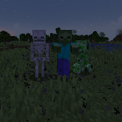

---
navigation:
  title: "Creature Wand"
  icon: "runecraft:creature_wand"
  position: 5
  parent: runecraft:wands.md
item_ids:
  - runecraft:creature_wand
---

# Creature Wand

<ItemImage id="runecraft:creature_wand" />

**__Effects__** 

**Right Click:** 
Spawns random monsters.

TODO: Unsupported flag 'border'

<Recipe id="runecraft:wands/rune_scriber_wand_creature" />

