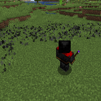

---
navigation:
  title: "Curse Wand"
  icon: "runecraft:curse_wand"
  position: 6
  parent: runecraft:wands.md
item_ids:
  - runecraft:curse_wand
---

# Curse Wand

<ItemImage id="runecraft:curse_wand" />

**__Effects__** 

**Right Click:** 
Releases a ring of negative spells, but also affects the user. 

**Left Click:** 
Curse a creature, but damages the user.

<Recipe id="runecraft:wands/rune_scriber_wand_curse" />

