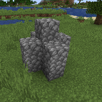

---
navigation:
  title: "Defensive Wand"
  icon: "runecraft:defensive_wand"
  position: 6
  parent: runecraft:wands.md
item_ids:
  - runecraft:defensive_wand
---

# Defensive Wand

<ItemImage id="runecraft:defensive_wand" />

**__Effects__** 

**Right Click:** 
Generates a cobblestone capsule around the user and gives it damage resistance. 

**Right Click + Shift:** 
Destroys the capsule.

<Recipe id="runecraft:wands/rune_scriber_wand_defensive" />

