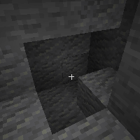

---
navigation:
  title: "Destruction Wand"
  icon: "runecraft:destruction_wand"
  position: 7
  parent: runecraft:wands.md
item_ids:
  - runecraft:destruction_wand
---

# Destruction Wand

<ItemImage id="runecraft:destruction_wand" />

**__Effects__** 

**Right Click:** 
Destroys the selected block instant. (Without drop) 

**Right Click + Shift:** 
Spawns primed TNT.

<Recipe id="runecraft:wands/rune_scriber_wand_destruction" />

