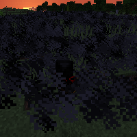

---
navigation:
  title: "Escape Wand"
  icon: "runecraft:escape_wand"
  position: 8
  parent: runecraft:wands.md
item_ids:
  - runecraft:escape_wand
---

# Escape Wand

<ItemImage id="runecraft:escape_wand" />

**__Effects__** 

**Right Click:** 
Releases a big smoke cloud and gives the user invisibility and movement speed.

TODO: Unsupported flag 'border'

<Recipe id="runecraft:wands/rune_scriber_wand_escape" />

