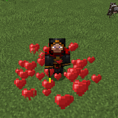

---
navigation:
  title: "Holy Wand"
  icon: "runecraft:holy_wand"
  position: 3
  parent: runecraft:wands.md
item_ids:
  - runecraft:holy_wand
---

# Holy Wand

<ItemImage id="runecraft:holy_wand" />

-----

**__Effects__** 

**Right Click:** 
Releases a healing effect cloud. 

**Left Click:** 
Heal creatures and damages undead.

<Recipe id="runecraft:wands/rune_scriber_wand_holy" />

