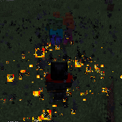

---
navigation:
  title: "Maelstrom Wand"
  icon: "runecraft:maelstrom_wand"
  position: 9
  parent: runecraft:wands.md
item_ids:
  - runecraft:maelstrom_wand
---

# Maelstrom Wand

<ItemImage id="runecraft:maelstrom_wand" />

-----

**__Effects__** 

**Right Click:** 
Releases a ring of wither spells. 

**Left Click:** 
Gives creatures a wither effect.

<Recipe id="runecraft:wands/rune_scriber_wand_maelstrom" />

