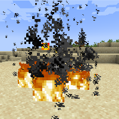

---
navigation:
  title: "Nether Wand"
  icon: "runecraft:nether_wand"
  position: 2
  parent: runecraft:wands.md
item_ids:
  - runecraft:nether_wand
---

# Nether Wand

<ItemImage id="runecraft:nether_wand" />

**__Effects__** 

**Right Click:** 
Releases a big fire. 

**Left Click:** 
Sets creatures on fire.

TODO: Unsupported flag 'border'

<Recipe id="runecraft:wands/rune_scriber_wand_nether" />

