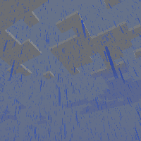

---
navigation:
  title: "Thunder Wand"
  icon: "runecraft:thunder_wand"
  position: 11
  parent: runecraft:wands.md
item_ids:
  - runecraft:thunder_wand
---

# Thunder Wand

<ItemImage id="runecraft:thunder_wand" />

**__Effects__** 

**Right Click:** 
Changes the weather to sunshine. 

**Right Click + Shift:** 
Changes the weather to rain. 

**Left Click:** 
Sends a lightning bolt to the creature.

<Recipe id="runecraft:wands/rune_scriber_wand_thunder" />

